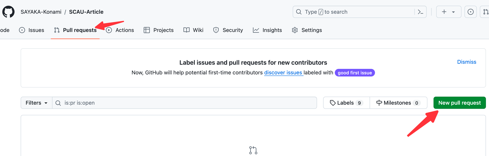
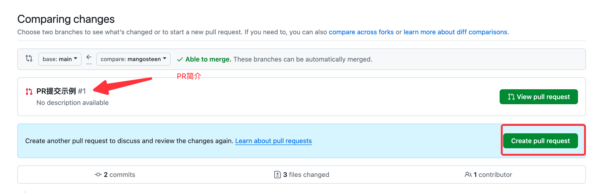
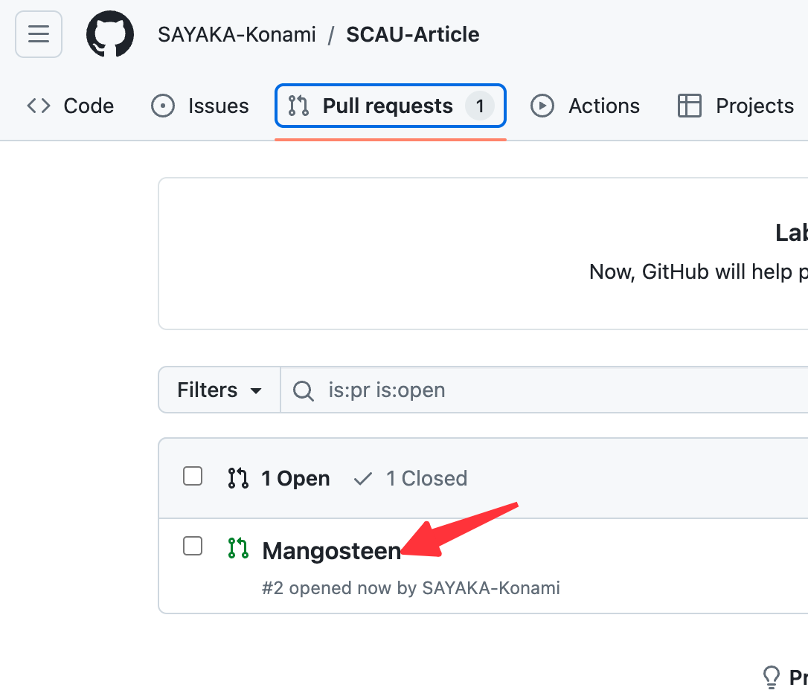

# SCAU生存手册
## 讲述你的故事
手册仅为SCAU的同学阅览参考，所以希望留下故事和感悟的你也曾是**SCAU**的学生。

大家多是俗人，读大学不外乎为了求学之后得一技傍身得以谋个好工作争个功与名。

非常可惜的是，这傍身的一技之长想习得也并非易事。更遑论去做科研，当学者。

如果你已经完成四年的求学之路，回过头看得踉跄的曾经以及自己走过了弯路思绪万千且感慨良多时。不妨在这里留下你的所思所悟留给后来的人看。
## 为什么是在Github
放在Github上其实已经把受众限制在了数信的学子里。
在我看来，如果一个数信的学生不懂得如何使用Github，那么应当是把精力放在了它处。也就不是本手册的受众了。
## 如何贡献
本仓库会分成五个目录，请遵循目录的规范进行贡献。
```
├── LICENSE
├── image（存放你要引用的图片）
│   └── mangosteen
│       └── img.png
├── major (对专业对看法，可包含较强的主观性）
├── master （考研、保研的经历）
├── public_servant （对应考公的经验）
└── work （对于求职的经验）
    └── your_nick_name （在你自己的目录下创建Markdown文件，上述所有目录都一样））
```
推荐使用 intellj或者vscode进行编辑。
### 以PR的方式合入主仓库
#### Fork本仓库

#### 创建一个新的 Pull Request




#### 查看本仓库的PR中是否有你提交的


在我确定文稿中没有涉政、脏话等其他因素后会将你的文稿合入本仓库。
然后更新到 [Gitbook](https://github.com/SAYAKA-Konami/SCAU-survival-manual) 上。

Wish you best!
