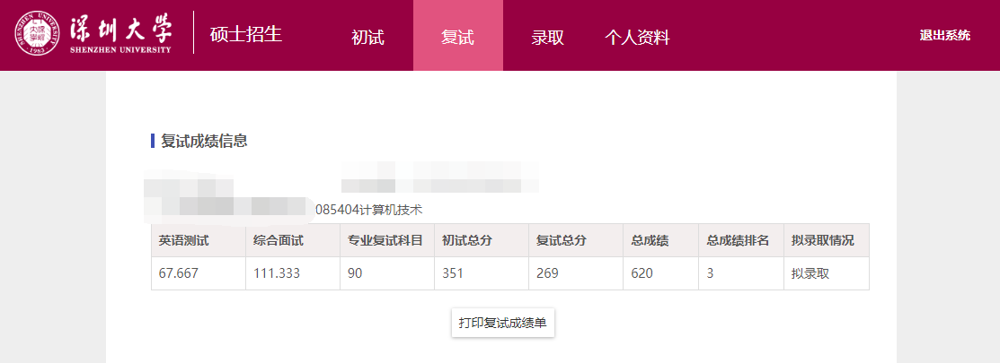
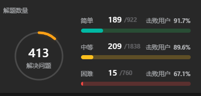
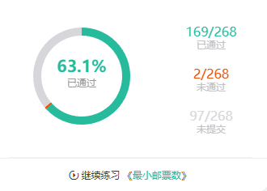
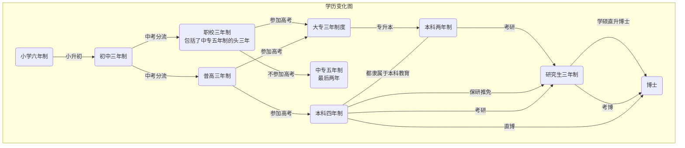
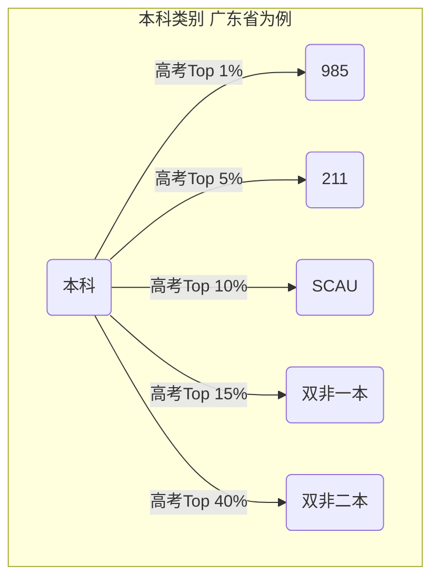
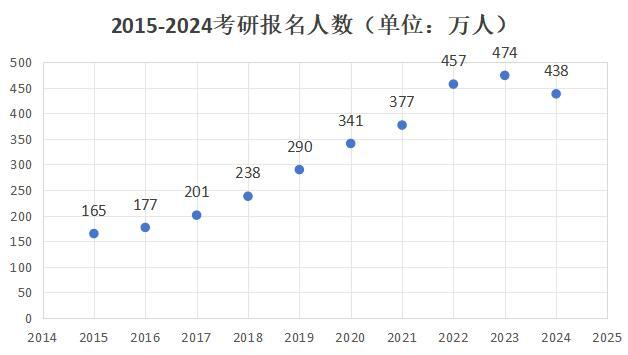
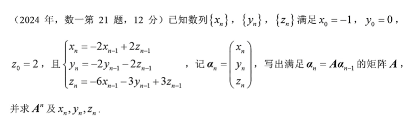
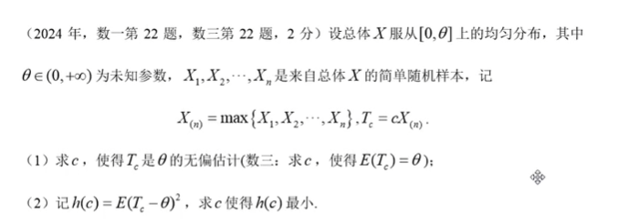
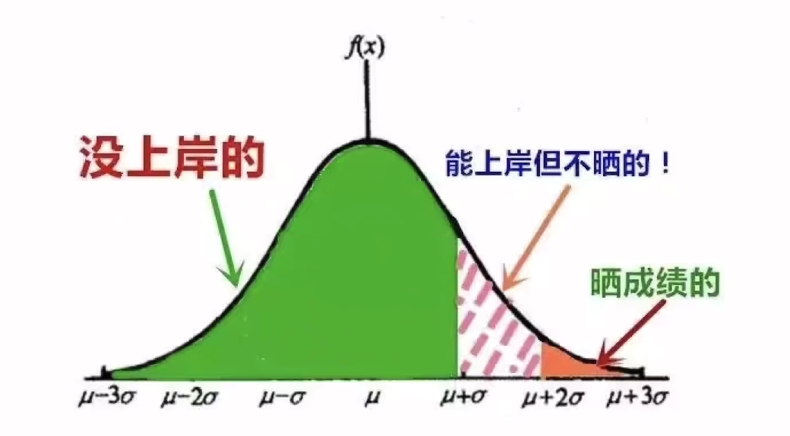
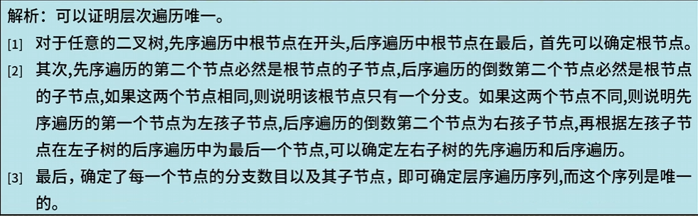

# 考研攻略第0章  介绍篇

## 0.个人情况

华农数信学院，数据科学与大数据技术第一届，无竞赛无项目，编程母语是Python为主，知道一些DL和ML相关的知识，2023年毕业，深圳本地人，两次报考深大，第一年报本部AI，尝试过光明实验室的调剂，去年317，主要原因是初试分数太低了，于是打算再战一年，因为一是本人有这个能力进复试的，二是还可以继续学下去，如果二战目标不拉高的话，且第二年不内耗，不摆烂，认真学，绝对能进去的

第二年是大数据实验室专硕，今年351，一志愿上岸；一战时期零零散散要么是在家，要么是在学校备考，二战时期短暂两个月（2023.5~2023.6）在学校图书馆稍微学了习，然后大部分时间呆在深圳家里，直到23年12月初试考完为止

这个是个人牛客网和Leetcode网刷题情况，牛客网的地址在王道蓝皮书，机考指南那里有；Leetcode题目去重的话，个人就刷了300道左右，刷题的周期是一年多

## 1. 考研概述
   - 考研的本质

要论考研的本质，我们需要从研究生这个东西入手，首先，我们普通人所认知的学历升迁过程是这样子的，这里以国内的六三三小初高制度为例

根据图的内容，学历变化图展示了从小学阶段到博士阶段的学历发展路径

学历的逐级提升包括了小学、初中、普高、职高、中专、大专、本科、研究生和博士等阶段

这图告诉我们，学历提升就是不断的筛人，从中考第一次分流，按照学习天赋，一些人去普通高中，另一个人去职校，其中职高分为三年职高参加高考的，也有五年中专职高等

普通高中除了北上广深发达城以外，其他小地方的高中都是一个超级中学，把全县最好教育资源集中在一起，比如我祖籍所在地的一中之类的，只有这个当地超级高中的学生才能迈进本科四年门槛，其他地方普通高中本科升学率很低，职校就不用提了

进入大学之后，大学期间如果想要成为博士的话，必须经历**保研/考研/直博**这三条路，才有机会可能成为博士，如果想要单单成为国内的硕士，需要靠**保研和考研**这两条路才行

直博这个就相当于在保研名额当中再筛选出超级精英来，也就是说，这些能够**保研的学生当中最厉害的，最能胜任繁重科研任务的那一批人**（能够保研本身就厉害的了）

在这里，本科如下图为例划定区分本科等级，其中985和211的保研机会多，课程相关实验室的实践的项目很多，可去的国企就业资源比较好；其次是华南农业大学普通一本，再其次是二本了，其中二本当中有民办二本，民办二本是**没有保研**这条路的，只有考研这个路才能升国内硕士

华南农业的数信保研是只有40个名额的，学院一共800多号人，规则是数信的各个系各个专业的各个班级去抢整个学院的指标，而且华农数学分为三大系，数学系/计算机系/信工系，华农数学学院计算机那些，我记得发的学位证有工学（计算机技术/数据科学与大数据技术/软件工程等）或者是管理学（信息管理/大数据管理等）

所以说，通过上面的情况，我们可以知道学历的提升必须要经历一个个的筛选阶段，而考研的本质就是通过根据国家要求研究生指标，在推免生保研保完之后，根据剩下指标留给考研的人，然后通过**一系列的考核筛选出能够承受未来繁重研究生学习生活的，并且毕业之后，能够成为尖端人才的人**，换句话说就是筛选出**适合科研和高级知识，学习和动手能力强的人**

**研究生比率对全国而言，[只有1%左右](https://kaoyan.eol.cn/nnews/202208/t20220810_2241248.shtml)，这当中包括了水硕**

   - 历年考研情况

     从下图所看从18年开始加速，到疫情三年持续攀升，再到今年热度下降，说明考研热度是很高的

考研热度的持续涨高，带来的最直观的经济效益就是各大补习机构赚的钱比以前要容易多了，各种各样的补习机构如“雨后春笋”冒出，我后面根据这个本质来讲一些关于考研UP主和某些考研机构的过去的**信息黑幕**，来告诉各位，考研教培这条产业链，这东西的水很深，考生因为**信息差**把握不住，如果**盲目且没有辩证地**听信了某些考研机构，或者UP主讲课的所讲述的考研刷题的方法论和练习论，是偏离考研大纲的话，可能就会**浪费半年甚至一年的时间**

那么为什么没有人制裁得了这些机构呢，首先第一点，机构财力物力强，第二就是他们确确实实的提供了所谓“考研服务”，确确实实符合法律法规，没有任何违规的事情，而且考研报课考生和机构之间是要阅读并签订合同的，第三，他们有教出个别的人，确确实实的上岸了，第四，出题老头睁一只眼闭一只眼，希望这些机构能**忽悠一批人是一批人**，这样子他们在出题的时候，好歹**筛人会轻松许多**，因为正态分布的分数线的均值和标准差国家教育局暗中早就划定好基准范围的，不然比如说，大家如果数一都能考110的话，那么被问责的就是这些给非数学系出题的教授们了

所以，如果出题老头了解到全体考生要是按照往年试题内容，轻轻松松上100分的话，那么今年就会偏向于出很难的题，譬如计算量繁琐心态炸裂的题，出思维隐性不好看出思路的题，或者是从数学系的教材里出习题。

   - 考研宏观情况

从18年的考研数学成绩来说，那些超过105分的人在考研当中属于少数派，如果你考了105分以上，你就已经打败了90%参与考研数学的同学了，24年出的题是堪比20年的难度的，个人认为18年的难度是小于20年的，所以在24年数学一能上105分的基本上很优秀了

今年的数学三的计算量和以前数学二一样了（因为以前数学三的计算量是远小于数一数二的），数学二难在计算量大且选填出的知识点比较偏冷门，尤其是那个数列敛散性判断（个人觉得），数学一难在斯托克斯公式大题（压轴），投影的平面模型是一个偏心椭圆，求面积的话计算繁琐

选填计算量大且思路很隐蔽，不容易算出来，出了数一独特考点的数列求和和高斯公式方向判别，线性代数填空题我个人完全没思路直接放弃了，概率论选填题计算量大；大题的计算量也是很大的，24年的数一第十七题（二重积分）的计算量和23年数一第十九题（高斯公式）差不多步骤一样，24年线性代数和概率论大题都是计算量偏大不好算的，线性代数是教科书那种类属于迭代公式，概率论是求特定值的。

从下面正态分布图来看，考研是**残酷**的，保守估计至少有**百分之70**的人会被刷下来，而小红书和知乎各大平台晒成绩的，一般是Top5%才会这样子的，其他成绩中规中矩的可能不会晒成绩，或者是也会晒，但把成绩晒出来的只有分数考得感觉好的，可以上岸的那一批人，大部分人国家线没过，或者是刚过国家线的可能晒成绩是为了求帮助找调剂之类的

## 2. 计算机考研科目
   - 11408

11408可以称得上工科天花板，冠上明珠，各大高校的计算机考研要求的科目当中，唯一比11408难的可能只有清华的11912，其中912是清华自命题的计算机综合。

> 下面这两张图是清华912数据结构章节独有的证明题
>
> 408的数据结构固定是两种个大题，一个是算法题，另一个是解答题
>
> 其中解答题考证明相关内容的，是在09年考过类似的，一般来说408的解答题聚焦于图论/树/排序算法/查找算法等，其中，408解答题重点偏向于计算和演绎分析，譬如说图论经常考查最值生成树，

> 这题比写牛客OJ当中[层序遍历序列和中序遍历序列确定唯一二叉树](https://www.nowcoder.com/practice/54713e2ad6ac4a6baa52838cff09662a?tpId=182&tqId=34876&rp=1&ru=/exam/oj&qru=/exam/oj&sourceUrl=%2Fexam%2Foj&difficulty=undefined&judgeStatus=undefined&tags=&title=%E6%A0%91)的代码题还难（个人感受）

数学一和408这两门科目是工科考研钦定范围科目当中最难的那几个之一，数学一难在各种各样的积分（线面积分，三重积分等等），概率论数理统计和线性代数学的广度和深度比数二和数三的要多，后面具体的细节我会讲

408难就是难在广度很大，知识点多且很扣细节，2024研究生入学考试计算机网络出了个路由协议大题，这是以前408计算机网络部分没怎么考过的知识点；数据结构考败者树，KMP改进算法，二次线性哈希查找，拓扑排序判定等；计算机组成和操作系统大题重点考察了指令集，计算机Cache和寄存器相关综合知识，线程PV关系和虚拟内存页表页框之类的，今年408最大特点就是涉及到的整数计算从之前的short型转变为int型为主，和数学一样，计算量增大；此外，408出的知识点和考点会越来越难，算法题连续两年考了图论，计算机网络出的大题是路由器协议之类的（之前的冷门考点）

个人认为408的难度会越来越大，因为408参与的学校也越来越多，选择报考的人会越来越多，408必须出偏题，计算量大的难题去筛人

   - 22408

数二和英二比数一和英一简单一些，个人认为的原因如下

1. 数二知识点相当于数一的一半，考数二的如果从1月份开始认真学基本上5月份就可以过完一轮基础，开强化了，数二强化时间大约有半年时间，而数一要多过额外的概率论和级数线面积分，还有其他额外小知识点
2. 英二作文图表好写，阅读简单，词汇量要求不是很高，而英一的作文占比大，图示漫画作文内容不好写，阅读要求难且深
3. 数二高分优势可以很好救408低分劣势，数一高分优势也可以救408低分劣势，但408很难高分，所以408救不了数学低分劣势
4. 22408难在408，11408难在数一和408，而且英一也不见得简单

所以22408在各个985院校一直以来分数卷的很高，基本上捞400分的一捞一大把

   - 11/22 + 自命题

这个就得看个人发挥以及对目标院校自命题掌握程度是否一步到位了，也就是靠比别人多的信息差能不能打败自己的直系竞争对手，重点是报考自命题所选择的路径会比考408的院校要窄，因为如果报考计算机自命题的学校一志愿没上岸的话，找调剂基本上比不过考408的，就大概率得重开一年了

## 3. 考研流程
   - 考试准备阶段

最好从大二暑假就开始准备自己要不要考研了，如果要考22408的话，大三上结束之后开来得及，如果是11408的话大二下暑假到大三寒假开始就得尝试过完高数/线性代数/概率论的基础知识了，或者是说多积累英文单词，在大三可以同时稍微看王道四门课的内容，或者是大三上去狂刷算法题，比如Leetcode和牛客网之类的，11408考一坤年这个不是开玩笑的，**知识广且难**

   - 考试报考阶段

考研报考目标院校只能是一个学校里的一个专业，也就是一志愿，要注意，你这战考研的关键性胜负就在于选择，**选择 > 努力**，比如说：

> *2024年370分11408选手在深大学硕是可以稳进的，但在北大软微是几乎很难入围复试的；310分的11408去华南农业大学学硕是可以的，但对深大来说这个分数很悬，除非这个人复试超常发挥*

   - 成绩查询和复试准备阶段

成绩查询一般放在新年之后，在此之前可以估分，如果自己分数估得很高的话，可以好好去接触DL和ML的内容了，如果不太行比较悬的话，就去刷牛客网和leetcode，这两个网站对找工作和练习机考很有帮助的，不仅仅要知道核心代码模式，还要很好处理ACM的IO处理格式等

## 4. 参考书目和大致做题过程
   - 408：王道全家桶，不过对于新手来说王道的书不容易上手得高分，经济条件宽裕可以考虑去报王道班，实在不行就去找网盘看盗版课

     

   - 数一：推荐考研金榜时代系列，660 + 880，看网课，但听课的过程中不要当成听故事那种！要多动笔，听课过程中看一题，先思考，有思路了，写题，然后倍数看这个题的解题步骤和答案，尝试着一题多解，重视基础，譬如说**求极限的知识**可以和**麦克劳林级数/导数泰勒公式**知识融会贯通起来

   - 英语：我英一考62分，阅读理解那边扣了14分，估分的话就主观题应该得分率超过60%，英一就每天用墨墨背单词刷单词，12月最后二十天看空卡作文模板和石雷鹏的融合起来，进行冲刺速成，阅读几乎没怎么刷过，一战刷的比较多，二战刷了不超过十套

   - 政治：1000题速成刷，但1000题考后感觉**比较鸡肋**，主要是刷**肖四**和**肖八**比较多，且刷过以前的**政治真题**等

## 5. 考研择教和UP攻略

考研选择教师，一定要是主流的老师才行，就是大众认可的老师

数学：武忠祥，李永乐，姜晓千，李林（基本上高考考进来的都是985而且是顶端985）

英语：英语可以不听课，主要是重视单词记忆和复习，一般我英语基础好的话（比如词汇量7000多）那种没太多时间去听英语课，而且11408时间紧，任务重

政治：肖秀荣，徐涛（不过政治这门课本身不建议看课，除非你的专业课是考马原和新思想的）

408：王道团队（咸鱼本科211，北大软微硕士，我知道的话王道基本上都是985硕的）

复试算法：代码随想录（哈工大985 ACM 后端大厂工程师）

UP的话，最多就白嫖一些资料，比如说，如果要听讲解的话，[数学就去听没咋了](https://space.bilibili.com/452790824?spm_id_from=333.337.0.0)，[吃尽天下面](https://space.bilibili.com/19742938?spm_id_from=333.337.0.0)等