# 第1章 论考研各大平台老师和UP以及背后黑幕

## 1.1 引言
### 1.1.1考研辅导平台的兴起

### 1.1.2为何需要了解考研平台的老师和UP

考研所考的知识点

### 1.1.3了解之后要做什么

## 1.2 了解讲师和UP重要性

## 1.3 考研平台讲师的风评和个人看法
### 1.3.1 政治

#### 1.3.1.1政治本质

政治本身就是一门很简单的课程，决胜选择题的话需要看历年真题的风格，还要有一定的历史常识（如果完全是历史小白的话）

#### 1.3.1.1 肖秀荣

#### 1.3.1.2 徐涛

#### 1.3.1.3 陆寓丰（腿姐）

#### 1.3.1.4 其他老师

#### 1.3.1.5 总结

我政治是最后悔刷大量题和稍微看课的，我个人感觉就提分**一点软用都没有**，浪费了我太多的时间，没有过多剩余的时间去投入到数一和408上，虽然和去年比起来**提升了9分**，但并没有达到我想要的最优化效果，**譬如数一120，408为105，**英一70那种对于我来说**，这样子的话我就有360了。。。

### 1.3.2 英语
#### 1.3.2.1 颉斌斌

#### 1.3.2.2 何凯文

#### 1.3.2.3 其他老师

#### 1.3.2.4 总结

### 1.3.3 数学
#### 1.3.3.1武忠祥

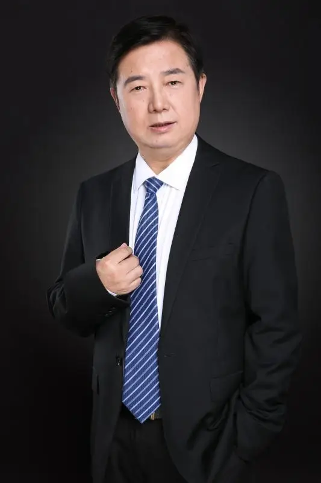

#### 1.3.3.2 张宇【目前36讲争议很大】

#### 1.3.3.3 李永乐

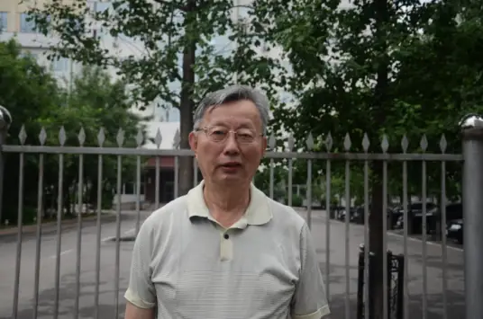

#### 1.3.3.4 姜晓千

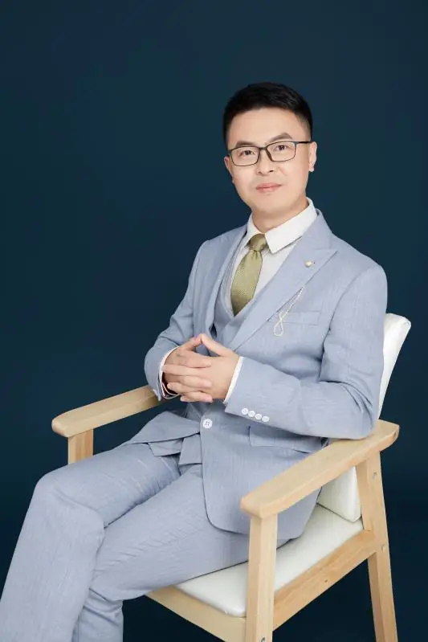

#### 1.3.3.5 李林【24李林6 + 4 套卷争议大】

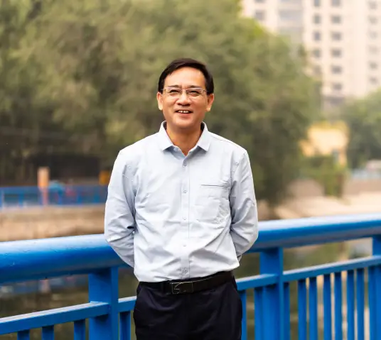

#### 1.3.3.6 王式安

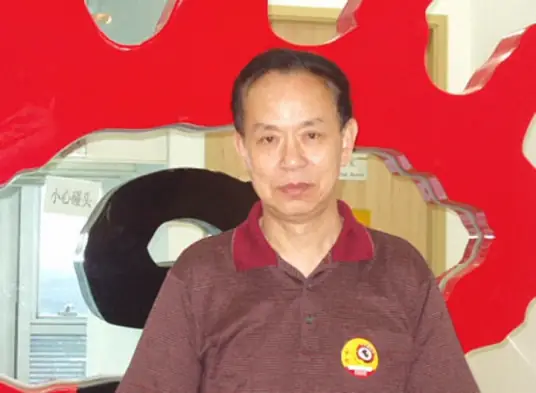

王式安，1987-2001年间担任全国[研究生入学考试](https://baike.baidu.com/item/研究生入学考试/5729689?fromModule=lemma_inlink)数学命题组组长，教育部考研数学命题组资深专家。原[北京理工大学研究生院](https://baike.baidu.com/item/北京理工大学研究生院/8916509?fromModule=lemma_inlink)院长、应用数学系系主任、教授，是享受国务院特殊津贴的数学专家，是美国[哥伦比亚大学](https://baike.baidu.com/item/哥伦比亚大学/513683?fromModule=lemma_inlink)、[南佛罗里达大学](https://baike.baidu.com/item/南佛罗里达大学/2244147?fromModule=lemma_inlink)、[纽约大学](https://baike.baidu.com/item/纽约大学/2610719?fromModule=lemma_inlink)等大学的客座教授。

个人在一战的时候概率论全程听过他的课，中规中矩，对概率论不会懵逼，然后在他课堂讲的时候暂停自己手写课上的例题，至少我一战二战的时候概率论成绩算不上很难看（可能得分率百分之60或者是70）那种，个人24考研的概率论错了一道小题和大题第二问算错答案

王老师在考研概率论的课上讲过，以前在本科教书的时候希望学生多问他问题，然后考试就喜欢考学生爱问的问题

### 1.3.4 408
- 王道考研

- 竟成考研

- 01考研

## 1.4 考研教培产业链

### 1.4.1  线下补习班

### 1.4.2 线下集训营

### 1.4.3 考研复试班

## 1.5 有争议的B站考研UP

### 1.5.1 考研竞赛凯哥

#### 1.5.1.1 个人经历

- 毕业学校：西南石油大学（本科硕士）
- 硕士专业：油气存储

- 考研经历：疑似第一年考数学系，数分80，高代零分，第二年考数二122
- B站地址：https://space.bilibili.com/42428180?spm_id_from=333.337.0.0

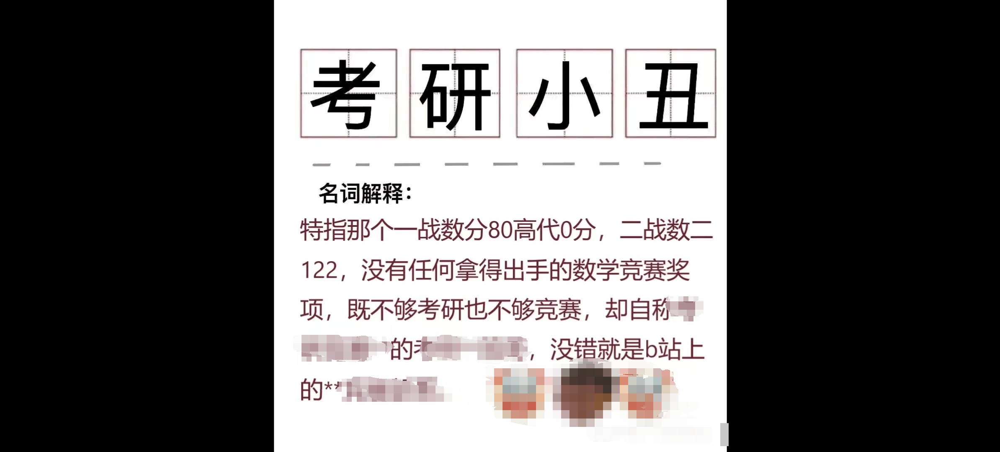

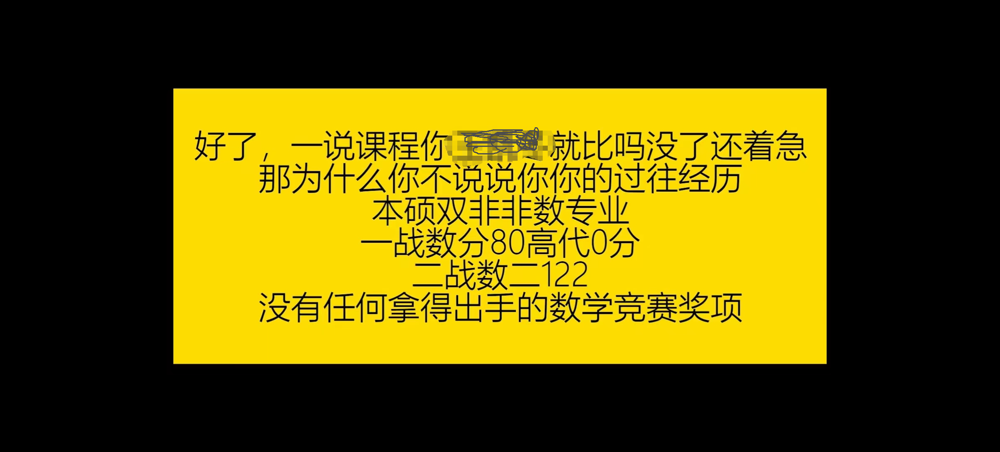

**上图均出自功德林从外面流出来的表情包，和本人没有任何的关系**，本人也不做任何评价，早在今年（2024）四五月份的时候，因为功德林一群群主制作的凯哥表情包，**侵犯法律上的肖像权**，他已经被”法律制裁“，凯哥起诉成功

#### 1.5.1.2 黑历史

- 黑幕：不对学员负责，圈钱为王，对同事下属违背契约精神，并对[前期某位学员](https://space.bilibili.com/362031334/dynamic)进行毫无依据上的起诉，被起诉的这位是功德林二群群主，和之前的那位人不同他压根就没有做凯哥表情包

- 作为公共人物在公共平台的发言和行为展示：

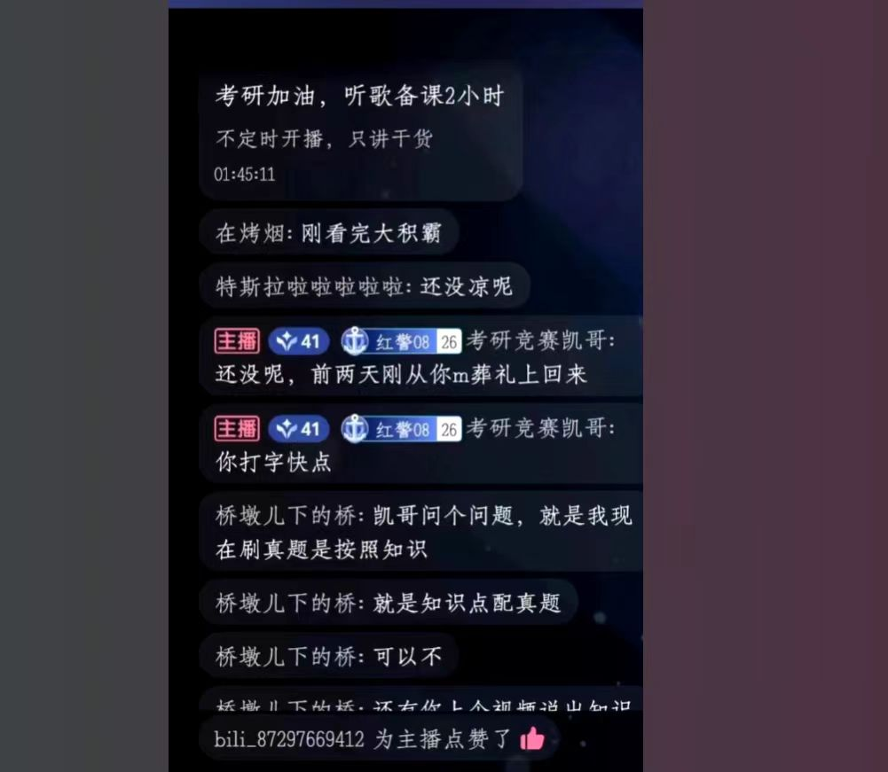

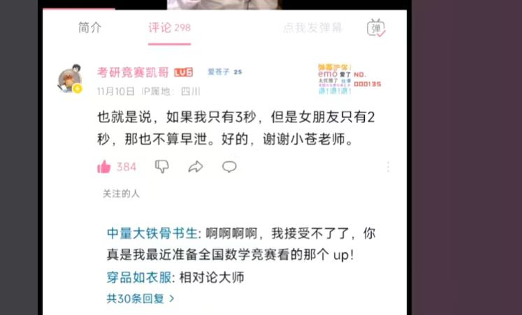

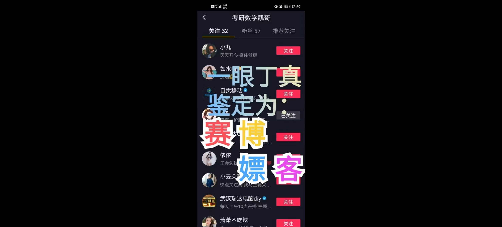

- 虎扑评价

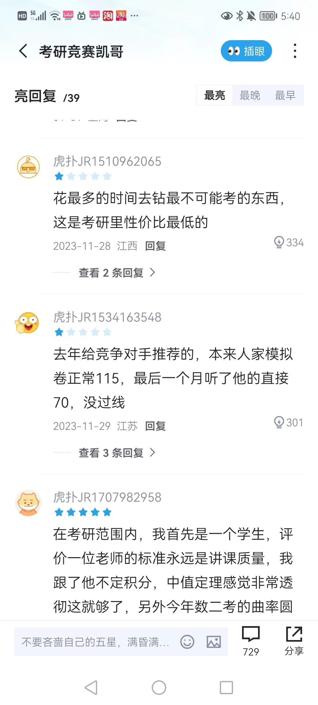

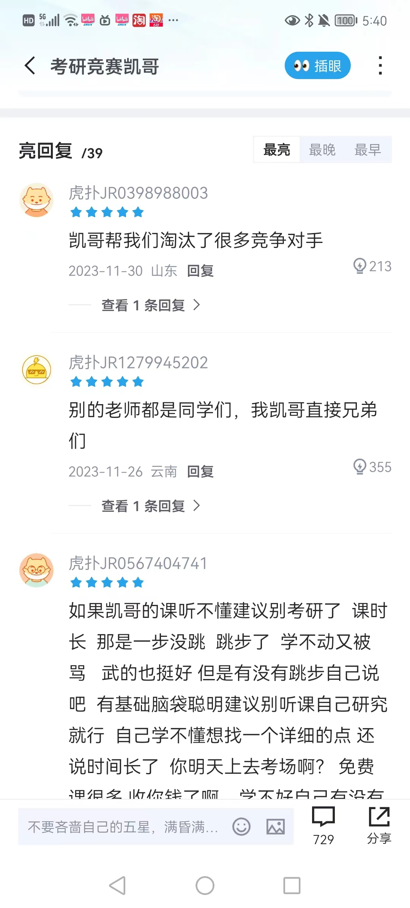

#### 1.5.1.3 看法

此处省略200字。。。

### 1.5.2 考研元哥

#### 1.5.2.1 个人经历

- 毕业学校：？
- 硕士专业：？

#### 1.5.2.2 诟病地方

- 讲课风格：讲的东西很废话，讲极限那边扯到什么育儿经，道德经，易经什么的，时间很长，喜欢PUA学生，传销一套
- 信口开河：说学生跟了他随随便便120，130

#### 1.5.2.3 看法

### 1.5.3 阿七牛杂

#### 1.5.3.1 个人经历

- 毕业学校：？
- 硕士专业：疑似中专肄业？
- 讲课风格：讲解垃圾，讲解都是靠他自己的一套理解，思维死结，容易自己给自己讲绕进去，而且**习题都是从大机构出的习题册（比如660，张宇1000等）和讲义那边盗取过来的**，还美其名曰说成是新时代习题集，侵犯知识版权
- B站地址：https://space.bilibili.com/1395703966?spm_id_from=333.337.search-card.all.click

#### 1.5.3.2 被人诟病的地方

- 引导网暴

- 倒打一耙

https://t.bilibili.com/936782760163409921?spm_id_from=333.999.0.0

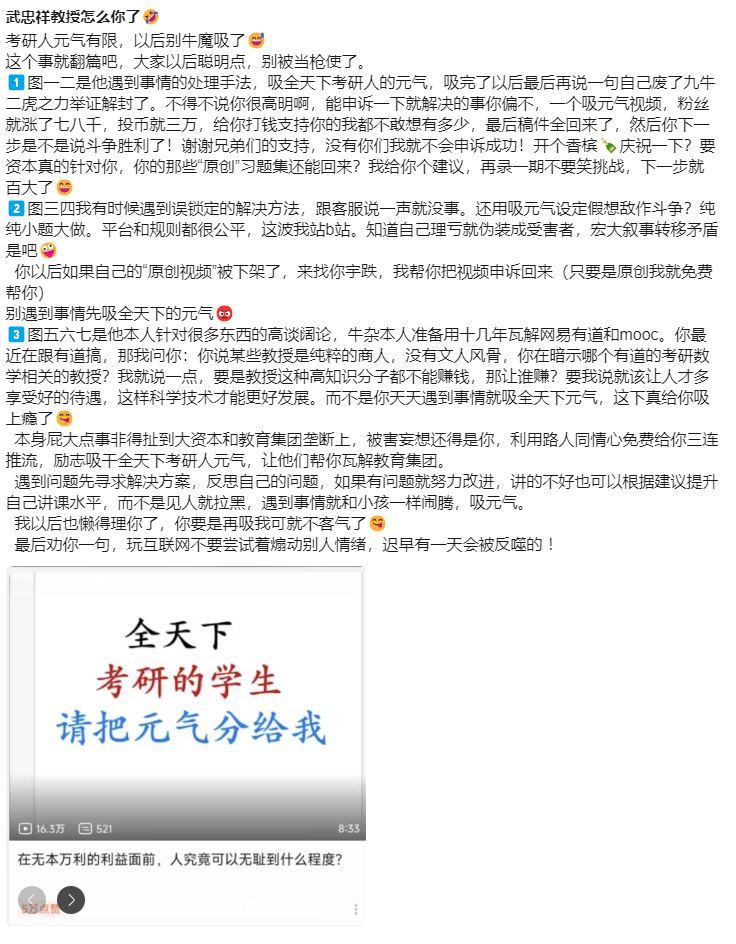

- 网络乞讨

- 广泛拉黑

https://t.bilibili.com/936469124469489673?spm_id_from=333.999.0.0

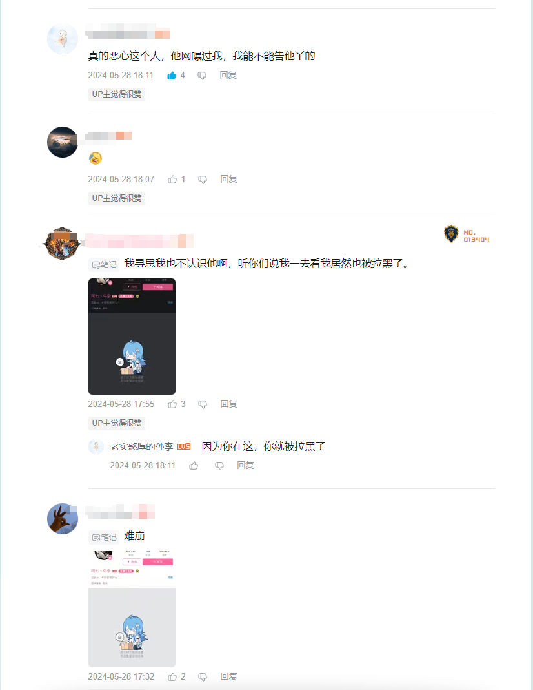

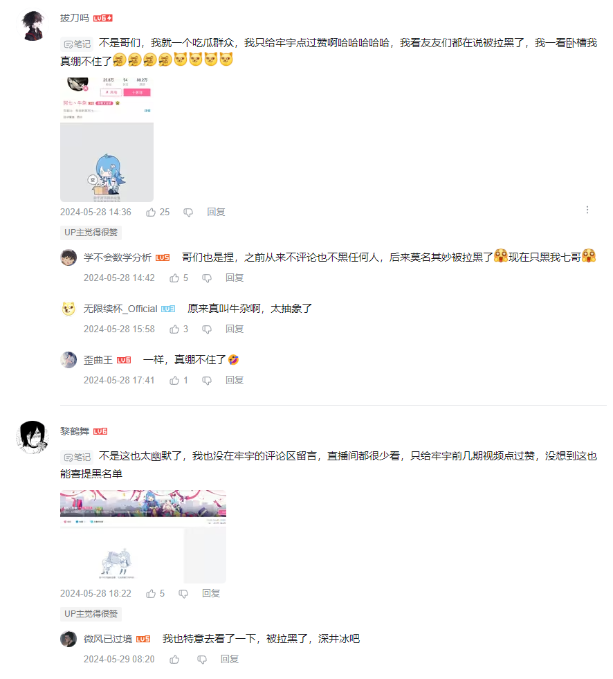

- 标题雷人

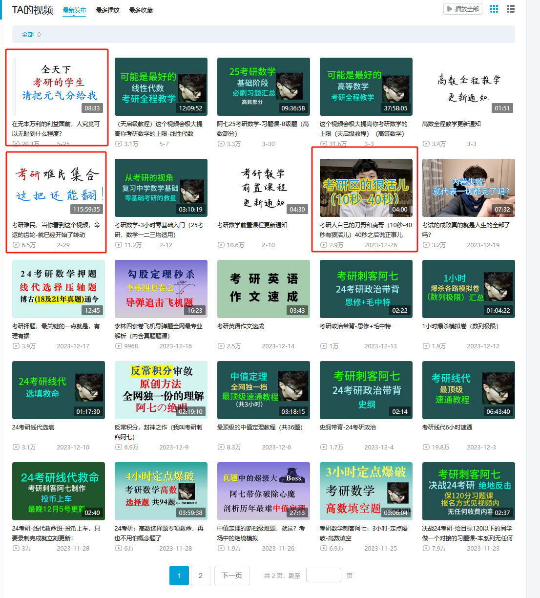

#### 1.5.3.3 看法

这个人就是数学讲不好硬要讲数学的人，数学讲不会的人，哪怕985本科背景的同学听了他的课都过不了国家线，纯粹就是学122的路线却没有122的命

### 1.5.4 空卡

#### 1.5.4.1 个人经历

- 本科毕业学校：华中科技大学
- 本科专业：？
- 硕士专业：营养学还是芯片封装（？）【本校】
- 博士专业：马克思主义原理 **【南昌大学211】**
- 考研经历：一战上岸，疑似是华中科大的专项计划，加上她那年考研容易，政治68【这成绩是很难说服大众的，你作为听她课的观众来说】，数学疑似是数二（？）或者是没考数学
- 黑幕：早年网络暴力过另一个美妆博主，22考研（21.12）那时候内涵肖秀荣，靠倒卖肖秀荣资料起家的

#### 1.5.4.2 争议点

#### 1.5.4.3 个人看法

### 1.5.5 考研斯基

### 1.5.6 小谭学长

### 1.5.7 个人观点

#### 数学篇

**老老实实跟着985背景出身的老师不好吗，尤其是金榜那些知名的老师譬如说武老师，姜老师或者是王老师**，为什么跟着一些B站奇奇怪怪，甚至是没有背景，或者是背景很差的人呢

虽然B站也有很多很好的数学良心UP主，还有背后的数学团队什么的，但是B站这个平台，就是一种鱼龙混杂的状态，你碰到好的数学UP的同时，也一定会碰到像阿七牛杂这一类人

#### 408篇

## 1.6 揭秘考研平台拿捏考生情绪的原理
- 救命班：

- 吸引人噱头的观点：

- 救命前的作文模板和答题模板：短时间速成作文是可能的，但是前提你**英语背的单词够多基础足够扎实**才行

## 1.7 个人总观点

## 1.8 结语
